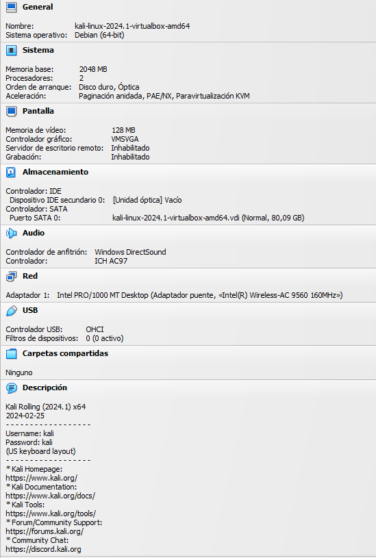
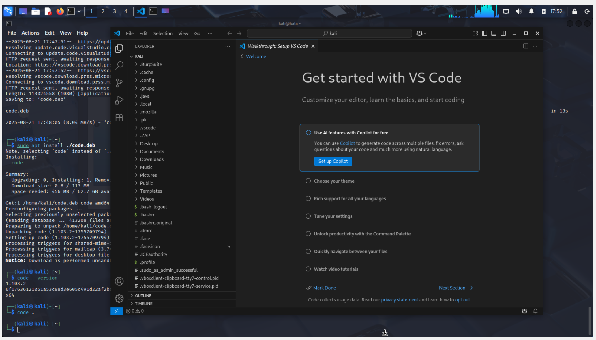
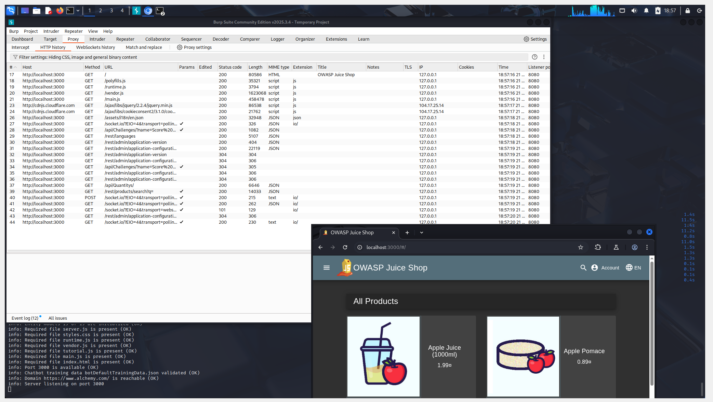
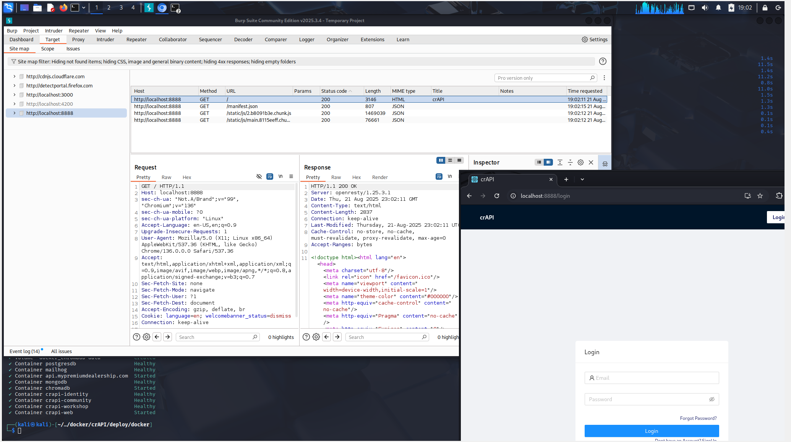

# Práctico 1 - Desarrollo de Software Seguro -

## Creación de ambiente de trabajo

### - Integrantes

- Franco Filardi

- Juan Diego Jacques

- Agustín Pose

---

### - Requisitos

- Una computadora que se la banque (si tiene escasez de recursos, utilizar un proxy y Docker) [^1]
- VirtualBox o VMWare instalado

---

### - Contenido

#### 1. Instalación de la máquina virtual Kali Linux

1. Descargar la **ISO de Kali Linux** desde [https://www.kali.org/](https://www.kali.org/).

2. En VirtualBox:
    
    -   Crear una nueva máquina virtual.
        
    -   Asignar al menos **2 GB de RAM** y **2 CPU**.
        
    -   Crear un disco de **30 GB o más**.
        
    -   Montar la ISO de Kali en la unidad óptica.
        
3. Iniciar la VM → elegir _Install_.

4. Completar instalación con usuario/contraseña (kali/kali).




---

#### 2. Instalación del proxy de interceptación

Se eligió **ZAP o Burp Suite**

- Pasos de instalación. MENCIONAR QUE KALI LINUX YA CUENTA CON BURP SUITE Y BLA BLA

- Configuración básica.


  
---

#### 3. Instalación de Visual Studio Code en Kali Linux

Para realizar la instalación de **Visual Studio Code** en Kali Linux seguir los siguientes pasos:

1- Descargar el paquete oficial en formato `.deb` desde la página de Microsoft:
```bash
wget -O code.deb https://go.microsoft.com/fwlink/?LinkID=760868
```
2- Instalar el paquete descargado:
```bash
sudo apt install ./code.deb
```
3- Verificar que la instalación se realizó correctamente ejecutar:
```bash
code --version
```



  

---

#### 4. Instalación de Docker en Kali Linux

Instrucciones de instalación + verificación con `docker --version`.


  

---

#### 5. Ejecución de OWASP Juice Shop en Docker

- Comando usado (`docker run ...`).

- Verificación desde el navegador.


  

---

#### 6. Ejecución de CrAPI en Docker

- Comandos para levantar CrAPI.

- Verificación.


---

### 7. Prueba de tráfico en el proxy

- Como se eligió **Burp Suite** como proxy de interceptación, se ejecutó con el comando `burpsuite` y se creó una instancia temporal
- A continuación, se levantaron ambos proyectos probados anteriormente (OWASP Juice Shop y CrAPI) y se los abrió en Chromium
  



---

### - Conclusiones
- Qué aprendieron.

- Dificultades encontradas.

- Importancia de tener este ambiente configurado para prácticas futuras.

[^1]: _Repaso de requerimientos_ en [presentación](https://docs.google.com/presentation/d/14oCaDqbFJmKry1sLu52F05zn_VbXAuCq/edit?slide=id.g14452321f13_0_160) de OWASP Uruguay sobre el práctico 1.
