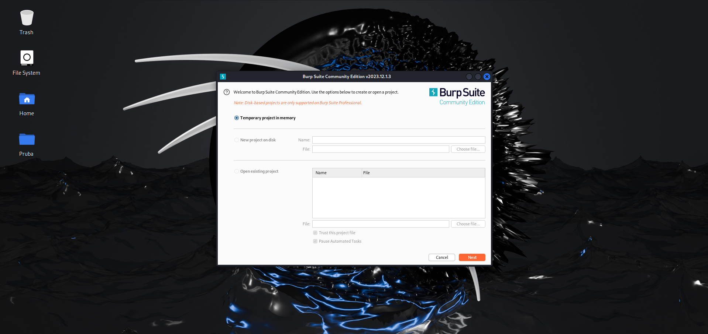
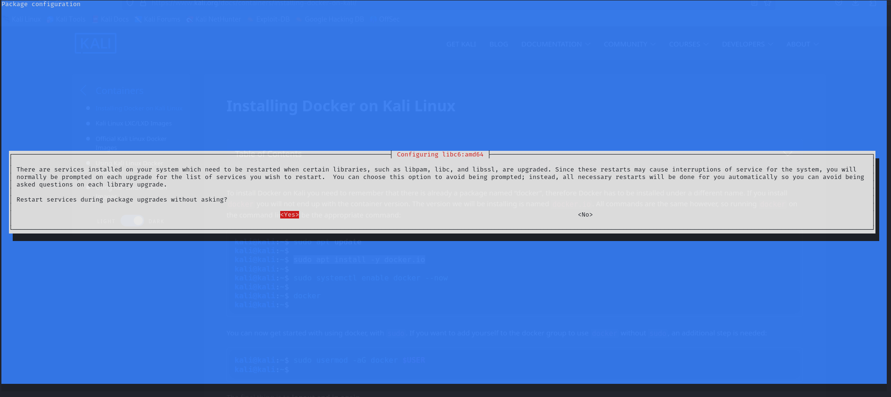

# Práctico 1 - Desarrollo de Software Seguro -

## Creación de ambiente de trabajo

### - Integrantes

- Franco Filardi

- Juan Diego Jacques

- Agustín Pose

---

### - Intro
- El objetivo de este documento es presentar el proceso de creaccion y configuracion de un ambiente de trabajo seguro para posteriores actividades de la materia, de forma cronica y explicativa,

---

### - Requisitos
- Una computadora que se la banque (si tiene escasez de recursos, utilizar un proxy y Docker) [^1]
- Herramientas: VirtualBox/VMware, Kali Linux, ZAP/Burp, VS Code, Docker, Juice Shop, Crappi.

---

### - Contenido

#### 1. Instalación de la máquina virtual Kali Linux

1. Descargar la **ISO de Kali Linux** desde [https://www.kali.org/](https://www.kali.org/).
Kali ofrece a la hora de installar maquinas virtuales "pre armadas" las cuales nos facilitan el proceso de configuracion del sistema y viene con credenciales por defecto. Sino existen varias alternativas para descargarlo, como la propia imagen.

2. En VirtualBox:
    
    -   Crear una nueva máquina virtual.
        
    -   Asignar al menos **2 GB de RAM** y **2 CPU**.
        
    -   Crear un disco de **30 GB o más**.
        
    -   Montar la ISO de Kali en la unidad óptica.
        


3. Iniciar la VM → elegir _Install_.

4. Completar insatlación con usuario/contraseña (kali/kali).

---

#### 2. Instalación del proxy de interceptación

Utilizamos como proxy de interceptación **Burp Suite**. COmo otra opción se puede probar con la instalación de **ZAP**

- En este caso con la instalacion de la maquina virtual de kali ya viene instalado como Proxy **Burp Suite**, entonces solo es necesario hacer el setup de la aplicacion.





- Vemos interfaz grafica de Bupr Suite con todas las herramientas que brinda
  
---

#### 3. Instalación de Visual Studio Code en Kali Linux

Para realizar la instalación de **Visual Studio Code** en Kali Linux seguir los siguientes pasos:

1. Descargar el paquete oficial en formato `.deb` desde la página de Microsoft:
```bash
wget -O code.deb https://go.microsoft.com/fwlink/?LinkID=760868
```
2. Instalar el paquete descargado:
```bash
sudo apt install ./code.deb
```
3. Verificar que la instalación se realizó correctamente ejecutar:
```bash
code --version
```


---

#### 4. Instalación de Docker en Kali Linux

Para la instalación de Docker en Kali Linux seguimos los pasos oficiales de la documentación de  [https://www.kali.org/](Kali.org). Durante la instalacion registramos los comandos ejecutados y sus salidas junto a la configuracion

1. Buscamos documentacion en [https://www.kali.org/](Kali.org)


2. Actualizamos con apt update el gestor de paquetes de Debian


3. Instalamos paquete docker.io

- Durante la instalación el sistema pidió confirmación para reiniciar servicios críticos como libc6. Se eligió la opción Yes para evitar problemas en futuros upgrades.

4. Instalamos paquete docker.io




5. Hablilitar y arrancar elservicio Docker


- Verificamos la instalacion con el comoando **docker** que muestra la lista de comandos disponibles

6. También se probo una instalacion alternativa para Docker CE 

- Se probó agregar el repositorio oficial de Docker CE para Debian (base de Kali) y actualizar la instalación:


7. Pro ultimo probar la ejecución con contenedor “Hello World”

- docker run hello-world


#### 5. Ejecución de OWASP Juice Shop en Docker

- Comando usado (`docker run ...`).

- Verificación desde el navegador.


  

---

#### 6. Ejecución de CrAPI en Docker

- Comandos para levantar CrAPI.

- Verificación.


---

### 7. Prueba de tráfico en el proxy

- Como se eligió **Burp Suite** como proxy de interceptación, se ejecutó con el comando `burpsuite` y se creó una instancia temporal
- A continuación, se levantaron ambos proyectos probados anteriormente (OWASP Juice Shop y CrAPI) y se los abrió en Chromium
  


---

### - Conclusiones
- Qué aprendieron.

- Dificultades encontradas.

- Importancia de tener este ambiente configurado para prácticas futuras.

[^1]: _Repaso de requerimientos_ en [presentación](https://docs.google.com/presentation/d/14oCaDqbFJmKry1sLu52F05zn_VbXAuCq/edit?slide=id.g14452321f13_0_160) de OWASP Uruguay sobre el práctico 1.
